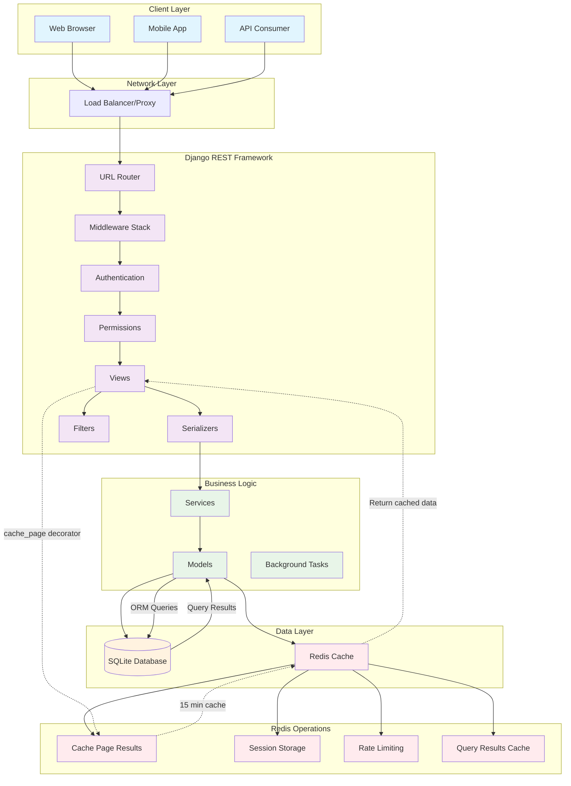
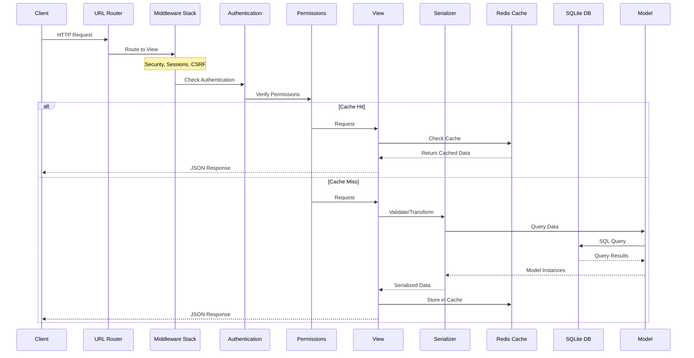
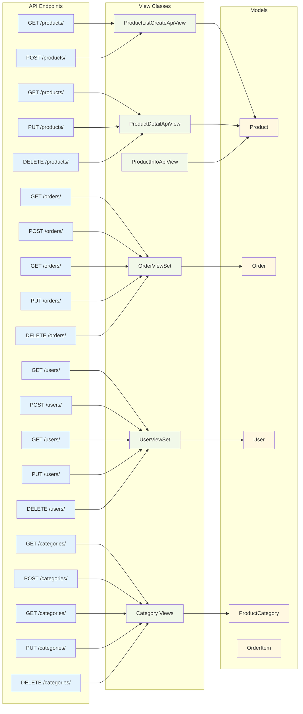
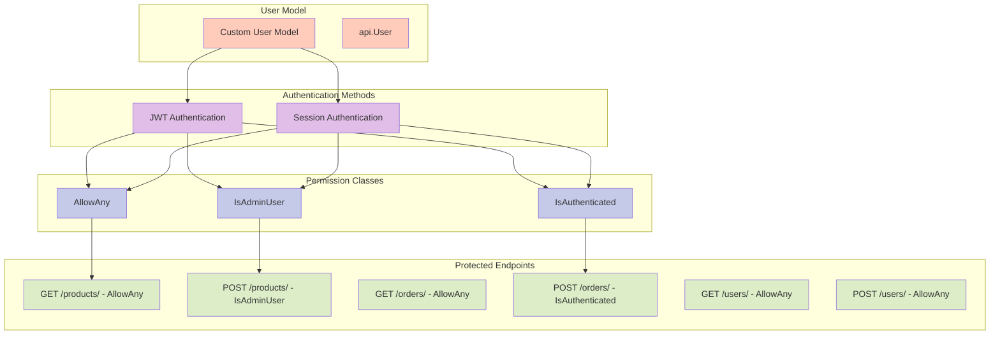
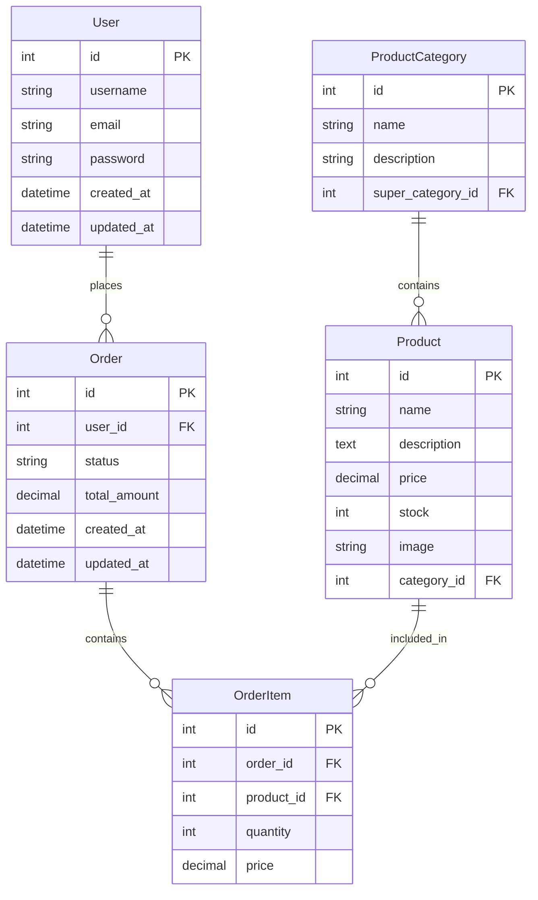

# Django REST Framework Architecture Flow Diagram

## System Architecture Overview



## Detailed Request Flow



## API Endpoints Flow



## Redis Caching Strategy

```mermaid
graph TD
    subgraph "Redis Cache Configuration"
        R1[Redis Server<br/>127.0.0.1:6379/1]
        R2[django_redis.cache.RedisCache]
        R3[DefaultClient]
    end
    
    subgraph "Caching Patterns"
        C1[Page-level Caching<br/>@cache_page(60*15)]
        C2[Query Result Caching]
        C3[Session Storage]
        C4[Rate Limiting]
    end
    
    subgraph "Cached Endpoints"
        E1[GET /products/<br/>15 min cache]
        E2[Product List Views]
        E3[Category Views]
    end
    
    subgraph "Cache Invalidation"
        I1[Manual Invalidation]
        I2[TTL Expiration]
        I3[Key-based Invalidation]
    end
    
    R1 --> R2
    R2 --> R3
    R3 --> C1
    R3 --> C2
    R3 --> C3
    R3 --> C4
    
    C1 --> E1
    C1 --> E2
    C1 --> E3
    
    C1 --> I1
    C1 --> I2
    C1 --> I3
    
    classDef redis fill:#ffcdd2
    classDef cache fill:#c8e6c9
    classDef endpoint fill:#bbdefb
    classDef invalidation fill:#ffe0b2
    
    class R1,R2,R3 redis
    class C1,C2,C3,C4 cache
    class E1,E2,E3 endpoint
    class I1,I2,I3 invalidation
```

## Authentication & Authorization Flow



## Database Schema Overview



## Key Features Summary

### Redis Usage
- **Primary Purpose**: Page-level caching for product listings
- **Configuration**: django-redis with Redis server on localhost:6379/1
- **Cache Duration**: 15 minutes for product list views
- **Cache Key**: `product_list` prefix for product endpoints

### Authentication
- **JWT Authentication**: Primary method for API access
- **Session Authentication**: Fallback for web interface
- **Custom User Model**: `api.User` instead of Django's default

### API Structure
- **Products**: CRUD operations with filtering and pagination
- **Categories**: Hierarchical category management
- **Orders**: Order management with user association
- **Users**: User management endpoints

### Performance Optimizations
- **Database**: SQLite for development (configurable for production)
- **Caching**: Redis-based page caching
- **Filtering**: Django-filter integration
- **Pagination**: PageNumberPagination with configurable page sizes
- **Query Optimization**: prefetch_related for related data

### Security Features
- **CSRF Protection**: Enabled for web interface
- **Permission Classes**: Role-based access control
- **Input Validation**: Serializer-based validation
- **SQL Injection Protection**: Django ORM protection 